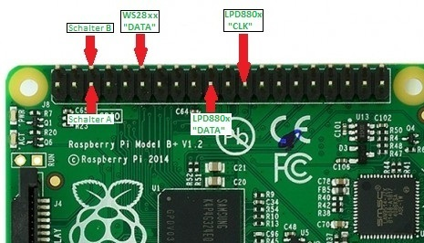

# word-clock

Eine Uhr mit Textanzeige und Audioauswertung basierend auf einem Embedded-Linux-System (z.B. Raspberry) mit adressierbaren RGB-LED-Stripes und 3D-druckbaren Gehäuseteilen
Die 3D-Modelle für das Gehäuse sind auf [thingiverse.com](http://www.thingiverse.com/thing:2137765) verfügbar.

Die Software ist für eine möglichst einfache Erweiterung und Anpassung ausgelegt.

## Verwendete GIT-Projekte

Neben dem Grundgerüst von [Georg Kaindl](https://github.com/gkaindl/ambi-tv), meiner [Erweiterung](https://github.com/xSnowHeadx/ambi-tv) wurde auch auf die Vorabeiten von [Karl Stavestrand](https://github.com/karlstav/cava) (Spektrum-Analyzer mit fftw3 und ALSA-Quelle) und [Jeremy Garff](https://github.com/jgarff/rpi_ws281x) (Ansteuerung der WS281x-Chips über PWM und DMA) zurückgegriffen.  

## Hardware Setup

Für den Aufbau des eigenständigen Ambilights werden folgende Komponenten benötigt:

- Raspberry Pi (beliebige Version mit aktuellem [Raspbian-Image](http://downloads.raspberrypi.org/raspbian_latest)) mit [Kühlkörpern](http://www.amazon.de/gp/product/B00BB8ZB4U)
- [WS2811 RGB LED Strip](http://www.ebay.de/itm/WS2812B-LED-Stripe-4m-RGB-60-LEDs-m-Klebestreifen-WS2811-WS2812-/251901768682?pt=LH_DefaultDomain_77&hash=item3aa683f3ea): Die Gehäuseteile sind für die verwendung dieser LED ausgelegt. Man benötigt einen Pegelwandler von den 3,3V des Raspi auf die 5V der LED. 
- alternativ [LPD8806 RGB LED Strip](http://www.watterott.com/de/Digital-Addressable-RGB-LED): Dann muß aber ein eigenes Gehäuse verwendet werden.
- [Audio-Grabber](https://www.amazon.de/dp/B01LW8CMN4/ref=cm_sw_em_r_mt_dp_OKRSybBAA919M): Nur erforderlich, wenn man die Audiofunktionen nutzen möchte.
- [1 5V-Netzteil](http://www.amazon.de/gp/product/B004S7U4IO)
- Tipp-Taster: Für diejenigen, die die Umschaltung nicht über das Web-Interface vornehmen.
- diverse Kabel, Lötwerkzeug

Hardwareaufbau:

- Zur Übersicht noch einmal die Auflistung der vorhandenen Signale:

    Raspberry Pi          Signal
    ---------------------------------
    P1/19 (MOSI)          LPD880x DATA
    P1/23 (SCLK)          LPD880x CLOCK
    P1/12 (PWM)           WS28xx DATA
    P1/5                  Taster Pin A
    P1/6                  Taster Pin B
    
Hier die Pinbelegung des Raspberry:

Wie oben schon angemerkt, muß bei Verwendung von WS281x-LED das 3,3V-Ausgangssignal des Raspberry mit einem Transistor oder einem Pegelwandlerschaltkreis auf 5V angehoben werden. Ob man den Wandler invertierend oder nichtinvertierend aufbaut ist unerheblich. Man muß die mögliche Invertierung aber später in der Konfigurationsdatei berücksichtigen.

## Software Installation

Bevor word-clock verwendet werden kann, werden für den Audio-Spektrum-Analyzer noch einige Bibliotheken und Tools benötigt. Diese kann man sich durch Eingabe von `'sudo apt-get install git libfftw3-dev libasound2-dev alsa-utils'` installieren.  
Um zu prüfen, ob der Audiograbber-Treiber geladen wurde, sieht man mit `'arecord -l'`. Hier sollte der usbtv-Treiber angezeigt werden:

    Liste der Hardware-Geräte (CAPTURE)
    Karte 1: Device [USB PnP Sound Device], Gerät 0: USB Audio [USB Audio]
    	Sub-Geräte: 1/1
    	Sub-Gerät #0: subdevice #0
   
Die Kartenummer "1" und Subgerätenummer "0" merken wir uns.

Wird ein SPI-LED-Streifen verwendet, muß sichergestellt werden, daß der SPI-Treiber geladen wird. Das läßt sich am einfachsten über "raspi-config" einstellen.

Nun clonen wir das word-clock-Repository mit `'git clone http://github.com/xSnowHeadx/word-clock.git word-clock'` in das Nutzerverzeichnis (in der Regel "pi"). Mit `'cd word-clock'` wechseln wir in das word-clock-Verzeichnis und bauen das Projekt mit `'make'`. Die ausführbare Datei finden wir nun im Verzeichnis "bin".
Zum Installieren mit Autostart führt man `'sudo make install'` aus. Nun wird word-clock bei jedem Start des Raspberry automatisch mit gestartet. 

Folgende Parameter akzeptiert word-clock beim Start:

- `-b/--button-gpio [i]`: Gibt den GPIO-Pin an, an welchem der Taster angeschlossen ist. Geschah das wie oben beschrieben, wäre das die `3` bei einem Raspberry Rev. B  (die `1` bei Rev. A). Standardmäßig wird `-1` verwendet, was bedeutet, daß der Taster ignoriert wird.
- `-f/--file [path]`: Der Pfad zum Konfigurationsfile, welches verwendet werden soll. Ohne Angabe wird `/etc/word-clock.conf` verwendet.
- `-h,--help`: Gibt einen Hilfebildschirm aus und beendet dann das Programm wieder.
- `-p,--program [i]`: Programmnummer, welche word-clock beim Start aktivieren soll. Standardmäßig ist das die `0`, also das erste Programm.
- `-s,--socketport [i]`: Port, auf welchem das Programm auf eingehende Kommunikation auf dem Web-Interface lauscht. Standardmäßig ist das der Port 16384.

Wurde word-clock von der Konsole aus gestartet, kann mit der Leertaste zwischen den einzelnen Programmen in der Reihenfolge durchgeschaltet werden, in welcher sie im Konfigurationsfile definiert wurden.  
Mit der `t`-Taste kann man zwischen Pause und Programmlauf hin- und herschalten. Im Pause-Modus sind alle Komponenten deaktiviert.

Mit dem über die Kommandozeile aktiviertem Taster kann durch einmaliges Klicken zwischen Pause und Programmlauf gewechselt werden. Ein "Doppelklick" schaltet ähnlich der Leertaste zwischen den definierten Programmen um. 

Im Repository liegt eine Beispiel-Konfigurationsdatei mit einer Zusammenstellung möglicher Programme. Die Parameter der Konfigurationsdatei werden im Folgenden erläutert.

## Konfigurationsdatei

word-clock verwendet eine Konfigurationsdatei für die Definition und Parametrierung von Komponenten und Programmen. Es können sogenannte **components** (also Funktionen) erstellt und parametriert sowie **programs** (also Programme), welche eine Zusammenstellung von Eingangs-, Verarbeitungs- und Ausgabefunktionen darstellen, festgelegt werden.

Eine Komponente ist ein Teil des Datenflusses in word-clock. Es gibt Quellen (Video-Grabber, Audio-Grabber oder einfache Binärdatengeneratoren), Prozessoren (Verarbeitungskomponenten, welche die Quelldaten auswerten) und Senken (geben die bearbeiteten Daten an den LED-String weiter). Die gleiche Komponente kann beliebig oft bei feststehendem Komponenten-Namen unter verschiedenen Instanzen-Namen und mit jeweils unterschiedlichen Parametern angelegt werden. Eine Komponentendefinition (zwei Instanzen der gleichen Komponente mit unterschiedlichen Parametern) sieht so aus:

    component_name {
        name            instance_nameA
        settingA        valueA
        settingB        valueB
    }

    component_name {
        name            instance_nameB
        settingA        valueC
        settingB        valueD
    }

Ein Programm besteht aus einer Kombination einzelner Komponenteninstanzen (im Normalfall eine Quelle, ein Prozessor und eine Senke). Es können beliebig viele Programme erstellt werden. Eine Programmdefinition sieht so aus (das "&" Zeichen am Anfang des Programmnamens ist zwingend notwendig):

    &program_name {
        activate        instance_name_source
        activate        instance_name_processor
        activate        instance_name_sink
        ...
    }

Am Einfachsten sieht man die Vorgehensweise in der Beispiel-Konfigurationsdatei.

## Verfügbare Komponenten

Im Moment unterstützt word-clock folgende Komponententypen mit ihren Einstellungen:

**audio-grab-source**: Der Audio-Grabber über das ALSA-Device des USB-Grabbers.  

- `name`: Der Instanzenname der Quelle, unter welchem sie mit den eingestellten Parametern in den Programmen verwendet werden kann.  
- `audio-device`: Der Name des geladenen Audio-Grabber-ALSA-Devices. Die Geräte- und Subgeräte-Nummer hatten wir uns ja oben gemerkt. Der Devicename lautet im Beispiel also `hw:0,0`.  

**timer-source**: Diese Quelle schiebt nur zyklisch eine Prozessorkomponente an ohne selbst Daten zu liefern. Diese müssen in der Prozessorkomponente generiert werden (Beispiel Mood-Light)

- `name`: Der Instanzenname der Quelle, unter welchem sie mit den eingestellten Parametern in den Programmen verwendet werden kann.  
- `millis`: Die Zeit in Millisekunden zwischen dem zyklischen Starts der Prozessorkomponente.

**audio-processor**: Verarbeitet die erfaßten Audio-Daten mittels FFT und wandelt sie in Farben um.

- `name`: Der Instanzenname des Prozessors, unter welchem er mit den eingestellten Parametern in den Programmen verwendet werden kann.  
- `atype`: Legt die Art und Weise der Verarbeitung der Audiodaten fest.
  * `0` bedeutet "Audio-Spektrum". Das FFT-Ergebnis wird als Farbband um den Bildschirm herum abgebildet. Die tiefen Frequenzen (rot) liegen dabei unten in der Mitte und laufen über das gesamte Farbband um den Bildschirm herum bis oben zu den höchsten Frequenzen (weiß)
  * `1` bedeutet "Audio-Mittelwert". Auch hier wird das Spektrum zunächst auf das Farbspektrum abgebildet. Es wird aber kein Farbband ausgegeben sondern der sich aus allen berechneten Farben ergebende Mittelwert wird auf allen LED gleich ausgegeben. Das ergibt einen nicht so unruhigen Effekt wie das Spektrum.
- `levelcolor`: Bestimmt die Farbe des Leuchtbalkens im Modus 2 im hexadezimalen Format RRGGBB (FF0000 ist rot, 00FF00 grün, FFFF00 gelb usw.). Bei einem Wert von 000000 wird statt der vorgegebenen Farbe der Farbwert, welcher auch beim Average-Modus berechnet wurde, verwendet. Dieser wird allerdings auf 100% Helligkeit normiert, da sich hier die Helligkeit aus der Länge des Leuchtbalkens ergibt. In den Modi 0 und 1 wird dieser Wert zwar nicht verwendet, muß aber angegeben werden (kann 000000 sein).
- `sensitivity`: Legt die prozentuale Verstärkung des Audiosignals vor der Verarbeitung fest. Damit kann das Ergebnis an kleinere oder stärkere Eingangspegel angepaßt werden. Werte zwischen 0 und 1000 sind möglich. 100 entspricht 1:1.
- `smoothing`: Sorgt für eine Glättung des FFT-Ergebnisses um den optischen Effekt zu beruhigen und ein Flackern zu vermeiden. Es stehen drei Glättungsfilter zur Auswahl:
  * `1` bedeutet "Falloff-Filter", welches das Fallen des zugehörigen Pegels einer Gravitationssimulation entsprechend verzögert. Zunächst fällt der Pegel ohne weiteres Signal langsam, dann immer schneller. 
  * `2` bedeutet "Mittelwert-Filter". Dieses mittelt vergangene und aktuelle Pegel und sorgt so für einen verzögerten Pegelabfall.
  * `4` bedeutet "Integrator-Filter". Das addiert die Pegel der Vergangenheit auf und fällt nur langsam ab. Dieses Filter sollte immer aktiviert sein, um die volle LED-Helligkeit zu erreichen.  
Es können mehrere Filter gleichzeitig aktiviert werden indem deren Zahlen addiert werden. `5` würde also z.B. Falloff- und Integrator-Filter gleichzeitig aktivieren. `0` deaktiviert die Glättung komplett. 
- `linear`: Das Ergebnis der FFT ist logarithmisch. Kleinere Ausschläge bei einer bestimmten Frequenz werden also verstärkt dargestellt. Das kann zum optischen Verschwinden der Unterschiede zwischen den einzelnen Frequenzanteilen führen. Mit `1` kann deshalb die Linearisierung aktiviert werden, welche die Anhebung der geringeren Pegel rückgängig macht und für eine bessere Kanaltrennung sorgt. `0` schaltet die Linearisierung aus.

**ledstripe-sink**: Die eigentliche Ansteuerung der LED Stripes.

- `name`: Der Instanzenname der Senke, unter welchem sie mit den eingestellten Parametern in den Programmen verwendet werden kann.  
- `led-device`: Das verwendete Device. Für LPD880x, APA10x bzw. WS280x z.B. `/dev/spidev0.0`. Für einen SK6812- oder WS281x-Stripe z.B. `DMA5` für den DMA-Kanal 5
- `dev-speed-hz`: Die Taktfrequenz für die Datenausgabe. Für LDP880x, APA10x  bzw. Ws280x z.B. `2500000` (2.5MHz). Für einen SK6812- bzw. WS281x-Stripe sind entweder `400000` oder `800000` möglich, abhängig von der Beschaltung der Chips durch den Stripe-Hersteller .
- `dev-type`: Der angeschlossene LED-Stripe. Gültige Werte sind `LPD880x`, `WS280x`, `APA10x`, `WS281x` und `SK6812`
- `dev-pin`: Nur für WS281x und SK6812. Der GPIO-Pin, an welchem die Daten ausgegeben werden sollen. Standard ist `18`.
- `dev-inverse`: Nur für WS281x und SK6812. Gibt an, ob der Pegelwandler das Ausgangssignal invertiert (`1`) oder nicht (`0`).
- `dev-color-order`: Gibt an, in welcher Reihenfolge  die Bytes der einzelnen Farben an die LED gesendet werden müssen. "RGB" bedeutet, daß zunächst das Byte für Rot, dann für Grün und zuletzt für Blau gesendet wird. Dieser Parameter ist optional und wird normalerweise automatisch passend zum ausgewählten LED-Typ gesetzt.
- `leds-top`, `leds-left`, `leds-bottom`, `leds-right`: Beschreibt die LED-Positionen auf den Bildschirmseiten. Die Adressierung der LED beginnt bei 0. Die Adresse einer LED ist also deren Position auf dem Stripe minus 1. Es können sowohl einzelne Indices getrennt mit "," oder auch Bereiche verbunden mit "-" eingetragen werden. Fehlende LED werden mit einem "X" gekennzeichnet. Beispielsweise bedeutet "33-56" "LEDs 34 bis 57", "22-5" bedeutet "LEDs 23 bis 6 absteigend", und "13-0,4X,97-84" bedeutet "LEDs 14 bis 1, dann ein unbelegter Bereich in der Breite von 4 LED und anschließend noch die LEDs 98 bis 85". Die "X" sind vor allem im Bereich des Fernseherfußes oder der Einspeisung sinnvoll um die Positionsberechnung nicht durcheinanderzubringen. Die Aufzählung der LEDs geschieht generell von links nach rechts für die obere und untere Kante und von oben nach unten für die Seitenkanten.
- `led-inset-top`, `led-inset-bottom`, `led-inset-left`, `led-inset-right`: Da die Stripes aufgrund ihrer Struktur nicht an beliebigen Stellen getrennt werden können, kann es an den Ecken vorkommen, daß die Streifen entweder länger oder kürzer als die eigentlichen Bildschirmabmessungen sind. Das kann mit diesen Prozentwerten einkalkuliert werden. So bedeutet z.B. ein Wert von '3.5' daß der Stripe an dieser Kante um 3,5% des Bildbereiches kürzer ist als der Bildbereich, ein Wert von "-1.2" bedeutet einen 1,2% längeren Streifen an dieser Kante.
- `gamma-red`, `gamma-green`, `gamma-blue`: Legt die Gamma-Tabelle für die einzelnen Farben fest. Da die LED-Stripes einen linearen Farbraum umsetzen, ist eine vorherige Gamma-Korrektur für eine farbechte Wiederabe nötig. Zwar könnten alle Einzelfarben mit dem gleichen Gamma-Wert arbeiten, für eine Anpassung an LED-Toleranzen oder farbige Hintergründe können die Gamma-Werte für jede Farbe separat festgelegt werden um solche Verschiebungen ausgleichen zu können. Werte zwischen 1.6 und 1.8 sind brauchbar, testhalber kann man aber auch Werte zwischen 2.2 und 2.8, welche dem PAL- und NTSC-Farbraum entsprechen würden, ausprobieren.
- `blended-frames`: Zur Beruhigung des Farbeffektes kann man den Prozessor einen gleitenden Mittelwert über mehrere Abtastungen bilden lassen. Damit wird ein Flackern der LED bei schnellen Bildwechseln verhindert. Je mehr Abtastungen einbezogen werden um so sanfter erfolgen die Farbwechsel. Das muß man nach eigenem Geschmack austesten. Ein Wert von `0`oder `1` deaktiviert die Glättung.
- `overall-brightness`: Legt die Gesamthelligkeit der LEDs in Prozent fest. Gültig sind Werte von 0..100.  
- `intensity-red`: Legt die Einzelhelligkeit der roten LEDs in Prozent der Gesamthelligkeit fest. Gültig sind Werte von 0..100.  
- `intensity-green`: Legt die Einzelhelligkeit der grünen LEDs in Prozent der Gesamthelligkeit fest. Gültig sind Werte von 0..100.  
- `intensity-blue`: Legt die Einzelhelligkeit der blauen LEDs in Prozent der Gesamthelligkeit fest. Gültig sind Werte von 0..100.  
- `intensity-min-red`: Legt die Minimalhelligkeit der roten LEDs in Prozent der vollen Helligkeit fest. Gültig sind Werte von 0..100.  
- `intensity-min-green`: Legt die Minimalhelligkeit der grünen LEDs in Prozent der vollen Helligkeit fest. Gültig sind Werte von 0..100.  
- `intensity-min-blue`: Legt die Minimalhelligkeit der blauen LEDs in Prozent der vollen Helligkeit fest. Gültig sind Werte von 0..100.  

## word-clock erweitern

Aufgrund der komponentenbasierten Struktur von word-clock gestaltet sich die Erstellung eigener Komponenten (Quellen, Prozessoren und Sinks) relativ einfach. Aus der Datei `component.h`, wird ersichtlich, wie man diese in die Verwaltung einfügen kann. Die Komponenten selbst kommen nach `src/components`.

Die Grundidee dabei ist, daß jede Komponente nur eine bestimmte Anzahl Funktionen bedienen muß, welche in einer immer gleichen Struktur mi Funktionspointern zusammengefaßt werden. Ihre Konfiguration erfolgt über den Kommandozeilenmechanismus `int argc, char** argv` welcher es ermöglich, die komfortable Funktion `getopt_long` für die Parameterauswertung zu verwenden.

Neu geschriebene Komponenten müssen in `registrations.c` durch Hinzufügen zu Liste bekanntgemacht werden.

## Web-Interface

Die Steuerung von word-clock über Webinterface funktioniert von jedem beliebigen Gerät mit Web-Client (Browser, wget, curl o.Ä.) aus. Hier eine Beschreibung der Befehle und Parameter für das Webinterface (statt "raspi" die IP des Raspi, statt "port" den beim Start in der Kommandozeile als optionalen Parameter angegebenen Port [default 16384] und statt "color" die gewünschten Farben "red", "green" oder "blue" verwenden. "n" wird durch die gewünschten Ziffern ersetzt. Die Kombination mehrerer Parameter in einem Aufruf wird noch nicht unterstützt).
Um einen Wert abzufragen statt ihn zu setzen ist bei dem jeweiligen Aufruf hinter dem "=" nichts einzutragen. In diesem Fall antwortet word-clock statt mit "OK" oder "ERR" mit dem für diesen Parameter eingestellten Wert. "http://raspi:port?brightness=" würde dann zum Beispiel bei einer eingestellten Gesamthelligkeit von 90% mit "90" beantwortet werden.

*Konfigurationsdatei auslesen:*  
`http://raspi:port?getconfig`

Aus dieser Datei kann man Anzahl, Anordnung und Namen der implementierten Programme sowie die nach dem Start eingestellten Werte für Helligkeit, Intensität und Gammawert der Farben auslesen. Auch die Einstellungen der Audiokomponenten sind so ermittelbar.

*Modus setzen:*  
`http://raspi:port?mode=n`

Welche Modusnummer welches Programm aufruft und wieviele Modi es gibt, hängt von den Einträgen in der Config-Datei ab. Alle Werte, die größer als der maximal mögliche Modus sind schalten das Ambilight aus. Die Zählung beginnt dabei bei "0" für das erste Programm.

*Gesamthelligkeit setzen (0...100%):*  
`http://raspi:port?brightness=nnn`

*Intensität einer Farbe setzen (0...100%):*  
`http://raspi:port?intensity-color=nnn`

*Gamma-Wert einer Farbe setzen (0.00 ... 9.99):*  
`http://raspi:port?gamma-color=n.nn`

Nicht vergessen: statt "color" die Farben "red", "green" oder "blue" einsetzen.

*Audioempfindlichkeit setzen (0...1000%):*  
`http://raspi:port?sensitivity=nnn`

*Spektrum-Filter setzen (0 - 7):*  
`http://raspi:port?smoothing=n`

*Linear-Modus setzen (0, 1):*  
`http://raspi:port?linear=n`

## Tools

Für Linux-Receiver mit Neutrino und LUA-Unterstützung liegt in "tools/" das Script "word-clock-config_lua", mit welchem man word-clock vom Receiver aus menügesteuert kontrollieren und parametrieren kann. Einige Screenshots der Menüs, welche einige Möglichkeiten der Steuerung demonstrieren sind [hier](doc/word-clock-config.jpg) zusammengestellt. 
